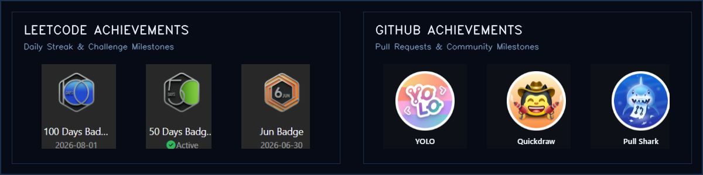

  

### Things I've built

| Project | What it does | Focus |
| :--- | :--- | :--- |
| [**BharatFarm**](https://souvikdey.me/projects) | AI-assisted smart agriculture platform focused on market linkage, price discovery & farmer workflows | AI + AgriTech |
| [**GrihaDarpan**](https://souvikdey.me/projects) | AI-assisted real-estate spatial intelligence platform with 3D visualization & Vastu analysis | Spatial AI + 3D |
| [**ResQAI**](https://souvikdey.me/projects) | AI-assisted emergency response infrastructure & architecture-based route mapping | AI + Emergency Systems |
| [**Yojana.AI**](https://souvikdey.me/projects) | Intelligent policy & scheme discovery platform driven by citizen context & NLP | GovTech + NLP |
| [**Medicine Reminder Pro**](https://souvikdey.me/projects) | Intelligent medication management & adherence tracking with smart alerts | HealthTech + PWA |
| [**MediGuard AI**](https://souvikdey.me/projects) | Automated prescription validation & clinical interaction safety checker | Healthcare + ML |

### GitHub Activity & Analytics

  
  

  

### Awards & Verified Credentials

  

  <a href="https://www.linkedin.com/in/souvik-dey-400497366">LinkedIn</a> &nbsp;·&nbsp;
  <a href="https://souvikdey.me">Portfolio</a> &nbsp;·&nbsp;
  <a href="https://souvikdey.me/projects">Projects</a> &nbsp;·&nbsp;
  <a href="mailto:souvik.business18@gmail.com">Email</a> &nbsp;·&nbsp;
  <a href="https://github.com/Souvik-Dey-2029">GitHub</a>

Curious by default. Building with intent.

